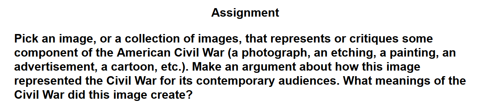



<a href="#fall" style="color: #6E352C;text-align:center;font-size:2em"> Go to Fall </a>

<a href="#winter" style="color:navy;text-align:center;font-size:2em"> Go to Winter </a>

###Kevin Wang

<a name="fall">  Fall 2014</a>

## Introduction and Mission

#### October 10, 2014

Hi, I'm Kevin!  I'm currently a first-year student at UC Irvine taking a course called the Humanities Core.  In essence, this class involves delving into the humanities - reading literature, learning history, theater, art, culture - and reflecting on a theme.  This blog will contain questions and answers about the theme and what I learn and want to learn about it from the material we read.  This year, the theme is war.  

Why study war?

War is a fruitful subject to study for the humanities.  It reveals a wide variety of truths about humanity and common human processes.
War reveals things about human nature such as desires, motivations, and fears.  By studying war, we can see how people decide what to do or who to follow.
War teaches basic human desires.  War is caused by humans who want power, resources, or pride.  By studying how actors act in war, we can deduce that humans are motivated by respect on one hand and shame on the other.  And in each human, we have ingrained values of tribal solidarity that make war possible.  
From war, we can also learn lessons are human fears.  From the Iliad, we can see that soldiers are motivated by wealth, spoils of war, and glory.  More than that, they are afraid of shame, and relentlessly flee from it by diving into battle.
And war can also teach about how people decide what to do.  People choose what to do based on the culture that surrounds them.  Throughout history, cultures have had varying values that would seem ridiculous by any other culture's values.  But in each culture, all values seem normal, and falling in line with the orders is nothing but compliance.  War is also in part a product of the herd mentality.  If each person evaluated war and their role in it in a non-warring culture, the fighting and ultimate self-sacrifice would seem laughable.  However, inside a culture of war and following orders, soldiers see war as normal and there seems to be no other realistic option besides obedience. 

***

## Who was Homer?  

#### October 17, 2014

Was there really a Homer?

For my Humanities Core class, I’ve been reading The Iliad.  In the first lecture, my professor touched upon the history and origins of the Iliad.  

In class, we discussed the historicity of the Trojan War described in the Iliad, and the factual accuracy of the epic (conclusion: it’s debatable, but it seems as if there was really a Trojan War).
However, one of the issues raised that really piqued my interest was the identity of Homer.  Professor Izenberg did not delve deeply into the question, although he did mention that Homer may or may not have been a real person, so I researched Homer on my own.  As it turns out, the identity of Homer is a well-established field of research, with its own Wikipedia article and everything.  The field is dubbed “The Homeric Question” and it concerns the existence of Homer, the identity of Homer, and the authorship of the epics.

Whether or not Homer existed isn’t a question that has been decidedly answered by anyone.  However, the name Homer is widely accepted as representing a manifestation of the ancient Greek oral tradition.  What this means is: although the works are attributed to Homer, an individual, the stories told in the epics are not the effort of a single man, but instead the result of centuries of oral storytelling passed down through generations.

This fact has an impact on how I think of the Iliad now.  Instead of attributing choices to one individual, I realized that each part of the Iliad has been touched upon and modified by hundreds of oral bards telling the story.

***

## What's the perception of the Thirty Years' War?

#### November 5, 2014

We've been reading literature pertinent to the Thirty Years' War in class lately, including the play Mother Courage (and modern performances of it) along with historical first-hand accounts.

As an American that previously knew basically nothing about the Thirty Years' War (other than its length), this made me wonder how the Thirty Years’ War is remembered today by the inhabitants of the involved areas and how it's changed since the 17th century.

My hypothesis when starting to research this was that the perception of the Thirty Years’ War in people’s minds was sure to have changed in some ways over the 300-plus years since its occurrence.

Although we in America are barely cognizant of the existence of the Thirty Years’ War, it had a huge and lasting impact on Europe and especially Germany.  It wracked the German states for 30 years, and killed 25% to 40% of the population.  As such, it must have made a deep impression on the citizens of Europe at the time.  

From von Guericke’s description of the Sack of Magdeburg, the war was a calamity for the inhabitants of Germanic states: the people of Magdeburg were robbed, beaten, massacred, and raped during the mass murder.  It was a time where people viewed others as horrible, evil, and greedy.  Grimmelshausen portrayed people as all inherently evil, in a view very much in line with the philosophy of Hobbes (who lived in the same time period).  Grimmelshausen especially represented the perpetrators of the war (the ruling class) as inherently selfish and wicked, which caused the ordinary citizens an immense amount of suffering through war.

Another interesting primary source from the time is paintings that were made of the war.  However, paintings that I found of the Thirty Years’ War are nearly all military and stoic in nature.  They try to accurately represent the military battles that occurred, and therefore most artists did not inject their own viewpoints and thoughts of the war into the paintings.  Still, I can glean information about the perception of the war through the paintings.  Nearly every piece of art about the war contains depictions of bloodshed, death, and fleeing.  Again, this is an a result of the people at the time perceiving the war as being perpetrated by bloodthirsty, cruel attackers.

*The miseries of war; No. 11, "The Hanging"*

I also researched the current day’s perception of the Thirty Years’ War in the same areas to see if there had been a shift in perception in the centuries since.  

*Batalla de Rocroi (1643) by Augusto Ferrer-Dalmau (2013)*

The war is still largely seen as one composed of bloodshed and terror.  This is due to the large amount of literature that was written during wartime, such as the primary sources I looked at above, and also the secondary works of fiction derived from those, such as Brecht’s Mother Courage, which make the war out to be a cold, cruel event.  
However, today the war is perceived in a few key ways that it wasn’t seen as in the 17th century.  Most noticeably, the war’s long-lasting political effects are appreciated now.  The Thirty Years’ War permanently changed the structure of nations in Europe immediately, and in everywhere not long after.  The residents of the 1600s who were directly involved in the bloodshed obviously couldn’t appreciate the effects that the war would have for hundreds of years, but today people see the ending of centralized ruling and the fragmentation of the European power structure, in addition to the bloody, cruel mess of the war.

***

## Mother Courage is Epic Theater

#### November 10, 2014

Mother Courage and her Children is a play written by Bertolt Brecht, in the epic theatre genre.  It details the journey of a woman travelling through the battlefields of the Thirty Years’ War with her children, profiting from the war, and losing her children to it.  
The attributes of a play of epic theatre emphasize the Verfremdungseffekt (distancing effect), which serve to remind the audience at all times that they are watching a play.  This is so that they do not develop an emotional attachment along with the play, which would result in emotional catharsis and not intellectual inspection during and after the conclusion of the play.  The latter is what Brecht aimed for in his play.  He wanted audience members to think about what Mother Courage says about society and war and how individual and collective action play roles in war, and how that can be changed.  

Scene Eleven is an excellent example of why Mother Courage is a play in the genre of epic theatre.  In it, we find that Mother Courage has gone into the town to “hunt for bargains”, leaving her daughter alone in a farmhouse.  The imperial army passes by the house to massacre the town (which is Protestant).  Kattrin decides to warn the town by banging a drum.  Because of this, she is shot and killed.  

The scene embodies the epic theatre genre in a few ways.  First, Brecht utilized humor throughout the grim and tense scene to interrupt the immersion of the audience.  Before the audience can start to be drawn into the scene, Brecht interrupts them with lines like “but we can pray to God and maybe because you’re a cripple He’ll listen better” to remind them that they are watching a play - to remind them that this is a play - a medium of expression, not entertainment.  
Brecht also sprinkles humor throughout the section of the scene where the soldiers attempt to get Kattrin to stop banging the drum and descend from the roof.  What would otherwise be an incredibly tense scene of suspense is changed into an almost comical comedy of errors.  For example, after a soldier unsuccessfully tried to convince Kattrin to come down from the roof, the Lieutenant spits out this gem: 
Lieutenant: You don’t believe him, you aren’t stupid, you know we’re not friends and anyway, who’d trust someone with a face like his?  But will you believe me if I give you my word as an officer of His Majesty the Emperor’s army?  My sacred word?

Kattrin drums harder.
Out of context, this could totally be a comedy.  But of course, it’s not, and Brecht simply uses these interruptions to make the audience feel less attached to the play.

  Another aspect of the play that Brecht utilized for epic theatre is blatant unrealism.  What he does to detach the audience from the play is to incorporate obviously unreal elements to remind the audience that they are watching a play.  In this scene, Brecht actually does this mostly by portraying the soldiers as highly incapable, which I mentioned above as an example of humor: They are painted as so incompetent that they become Three-Stooges-comical.  One example of this unrealism that isn’t comedy is when the soldiers attempt to drown out the sound of drumming with the sound of “a normal noise”, “a peacetime sound” - “wood chopping!” and Kattrin, along with the audience, laughs at their attempts.  Unlike an actual girl on the brink of absolutely sure death, she laughs at the humor of the soldiers’ incompetence, reminding the audience, again, that they are watching a play put on my actors and written by a playwright.

***

## The Prince: Sincere or Satire?

#### November 24, 2014

We all know Machiavelli.  Writer of The Prince.  Synonymous with tyranny and selfish power-thirst.  Corrupt, evil, immoral.
The Prince emphasizes the values of glory for tyrants over the well-being of their subjects.  But Machiavelli mean to advocate these actions sincerely, or was The Prince actually a backhanded satire meant to expose the evils of tyranny and principalities?

Machiavelli wrote The Prince in the form of a sort of self-help guide to instruct princes on how to rule their principalities.  In it, Machiavelli recommended many unethical means to selfish ends in an absolutely unempathetic style.  This stoich cruel and discompassionate writing style was so starkly cynical and evil that this style of power-hungry tunnelvision is known as Machiavellian.  
For example, The Prince recommended tyranny for princes. and advocate the thirst for power at the expense of the common people.  He advocates cruel and forceful action against people as means to gain and hold power.  Even when The Prince recommends moral actions for rulers, such as not stealing the property of their subjects, the reasons are always to keep power, not because of any code of ethics.  
As the author of a book that recommends such tyranny and corruptness, Machiavelli seems deserved of his title as cunning and deceitful.  However, literary scholars have recently raised an opposing thesis: that Machiavelli was in fact an opponent of tyranny and the corrupt tactics used by princes, and instead, favored republics.  This theory hypothesizes that Machiavelli wrote The Prince, not as an earnest guidebook for princes, but as a satire on the unscrupulous methods employed by princes of the time.
Machiavelli actually grew up in Florence when it was a republic.  He also served as an official in Florence during the time when it was a republic.  Hence, it’s reasonable to assume that he agreed with the principles of republics.  Diderot and Rousseau both judged The Prince to have been written as a satire.  Rousseau wrote: “Machiavelli was a proper man and a good citizen; but, being attached to the court of the Medici, he could not help veiling his love of liberty in the midst of his country's oppression. The choice of his detestable hero, Caesar Borgia, clearly enough shows his hidden aim; and the contradiction between the teaching of the Prince and that of the Discourses on Livy and the History of Florence shows that this profound political thinker has so far been studied only by superficial or corrupt readers. The Court of Rome sternly prohibited his book. I can well believe it; for it is that Court it most clearly portrays.”
The Prince is never farcical enough for anyone to definitely prove that it was written as a satire, so we may very well never know what Machiavelli intended it to be.  But based on the content of the book, as well as Machiavelli’s background in Florence, it’s a pretty good guess that The Prince was meant to ridicule - not instruct - the princes of his time.

***

## Last Post

#### December 12, 2014

This is my last post on this blog - for Fall Quarter, at least.  Over the course of the last 10 weeks my understanding of war has grown enormously.  The philosophy, the debates about individual and collective agency in war, the justification of wars, action in wars - these are all things that I’d never thought of before the quarter which I am now wholly aware of.  
It’s interesting how 10 weeks and some books morphed my mental model of war.
Beginning the class, I remember my concept of war was very basic: two or more forces in conflict with each other.  That was all that I thought about war.  I had never given any thought to the causes of war, or how they related to humanities.  I’d never heard of ius in bello or ius ad bellum.
Now that I’m basically done with this quarter, I can see why the course instructors chose war as the theme for this overarching humanities class.  The amount of material that exists about this topic in the humanities is probably larger than any other explorable topic.  I’d never before realized how uniquely ubiquitous war is in humanity.
Learning about war this quarter hasn’t really answered any questions that I had before I started thinking about these topics.  Rather, it’s made me admire the complexity that exists in war, and forced me to think about a whole new slew of issues, like the passage of history through oral tradition, the perception of war over time, and the influence of individual and collective agency in war.  
Studying humanities by using war was the perfect vector for learning about the humanities in general due to the wide reach of war in humanity.  Likewise, using humanity to study war was the perfect window into war itself, and looking back, I’m glad that I spent this quarter learning about one of the most complex and universal human things.  Onward to winter!

***

<a name = "winter">Winter 2015</a>

##I'M back

#### January 8, 2015

It’s 2015!  Welcome back to more Humanities Core  for the winter quarter!  We’ve recently been discussing Frederick Douglass’s slave narrative in this course.  One specific point that was brought up in the lectures and discussions was the purpose and use of Frederick Douglass’s book as propaganda.  That is, not to say that “Narrative of the Life of Frederick Douglass, an American Slave” contained falsehoods or promoted some evil agenda, but simply to say that the book was written to promote an agenda.  In this case, the cause was the cause of abolitionism.  Frederick Douglass appealed to his audience to gain support for the antislavery movement.
What this reminded me of was a recent segment on the talk show “Last Week Tonight with John Oliver”.

<iframe width="560" height="315" src="https://www.youtube.com/embed/QplQL5eAxlY" frameborder="0" allowfullscreen></iframe>

In this segment, John Oliver casts light on the process of emigrating refugees from Afghanistan and Iraq, specifically American-allied translators, to America.  John Oliver (in a technique probably learned from his forebear Jon Stewart) gathers support from his audience by pointing out the absurdity of the situation - civilians in Afghanistan and Iraq were recruited by the American military to risk their lives and their families’ lives to help America further its goals, but the American government will not grant them visas for them to escape certain death from the Taliban in their home countries.  
Similar to the way that Frederick Douglass told a specific narrative about an individual (his own) to highlight resonating emotional stories, John Oliver told the story of Mohammad, a translator who, because of his translation job, had his father killed by the Taliban, and his son kidnapped.  The visa paperwork process took over 3 years, during which Mohammad could not leave or evacuate his family.  The extreme emotional empathy that everyone feels upon hearing this story is utilized by Oliver to evoke anger at the United States government for causing his pain to happen.  This usage of pathos parallels Douglass’s slave narrative to gain support for their respective causes.

***

##Pop War

####January 15, 2015

A recent Humanities Core lecture gave me a completely new perspective in a way that I hadn't thought about before: popular depiction of war.  OK, yes, I've definitely thought about the public depiction of war several million times this year because I'm in Humanities Core and the theme *is* war.  But I'd never realized that an entire population of people could have had an imageless representation of war.

So in this lecture, Professor Alice Fahs discussed the fact that the Civil War was the first photographically documented war.  What this means is that before the Civil War, normal people had never before seen the realities of war.  The best that war could be represented was through painting representations and through oral or literary stories.  Such depictions showed the romantic side of war: of war abstracted through things like victory, bravery, and strategy.

However, the American Civil War, for the first time, was a war that took place with photography.  At the start of the Civil War, the war was shown in popular media as a celebratory event: one which would be over quickly and result in a positive victory.  It was almost like a festive event!  

However, when the war continued, different representations of the war soon appeared.  Most notably, photographs of the battlefields came through.  Cameras at the time required static scenes for long periods of exposure, so battlefields after the fighting had finished were the only possible subjects of photography.  

|  |
| :-----:|
|*Petersburg, Va., April 1865 source: Wikimedia Commons*|

These images were of the battlefields littered with dead bodies.  For the first time, people in America that weren't soldiers saw the effects of war - the REAL effects of war.  This sparked a movement that sought to find the real negative effects of war and portray them for the American public.  No longer did people sit and view war as an abstract concept, but instead they saw the death and pain that it inflicted.  Dickinson and Walt Whitman further introduced the pain and suffering of people from war into popular culture through poetry.  

What really shifted my mind's paradigm of war was this idea that people did not always have a concept of the death and bodies that resulted from war.  As someone who grew up surrounded by visual media (television, newspapers, computers, textbook pictures), I've never experienced a shortage of war photography.  To realize that people, at one point, were deprived of the real suffering of war and instead viewed it as something that could be associated with happiness was something that I'd never considered, and it was interesting to think about the Civil War as the turning point in civilians' mental models of war.

***

##Winslow Homer: American Painter

#### February 3, 2015

The most prominent assignment this quarter in Humanities Core is an essay that I have to write.  The essay assignment is to write about an image that relates to the American Civil War, and explain what it shows about the Civil War and the perception of the Civil War.  To pitch us students the essay prompt, the lecturing professor showed slides of various images produced during the Civil War.  I don’t really believe in love at first sight, but there were definitely a few paintings in that slideshow that really jumped out at me in their beauty.  They were paintings by Winslow Homer, who I previously hadn’t heard of.  

|  |
| :----: |
|*The Essay Prompt*|

I wrote my essay about a Winslow Homer painting (The Cotton Pickers), but that essay was about the Civil War.  This blog post is about the art.

Honestly, just like most art, I don’t think I can adequately explain why I took such a strong fancy towards Winslow Homer’s paintings, but there’s definitely something unique about their style that I just find beautiful.  I’m going to try to explain anyways.

Winslow Homer’s paintings really exemplify American culture to me.  From Mark Twain to Emily Dickinson to Norman Rockwell, artists classified as “American” focus their lenses on the ordinary person - the American.  Homer’s paintings about the Civil War do exactly that.  He paints paintings that are full of strife and the conflict of the Civil War, yet they all convey some kind of peace and serenity to me.

|  |  |
| :-------------: |:-------------:|
|*The Gulf Stream - 1899* | *A Visit from the Old Mistress - 1876* |

Homer painted in a realistic style: his paintings look true-to-life.  However, his paintings were also more than just realistic.  Each of his paintings manages to also evoke additional meaning.  Each painting seems to be so free of anything other than the raw reality of his subjects, but there is so obviously more than that.

*The Cotton Pickers - 1864*

For example: The Cotton Pickers.  The Cotton Pickers, especially, looked beautiful to me.  The beautiful, realistic representation of African Americans stood out amongst the various racist caricatures in the slideshow.  The golden sheen and the artistic landscape jumped out in terms of aesthetics.  Additionally, I appreciated the depth of analysis that I could put into the artwork to write about for my class.  It’s a realistic painting.  It looks similar to what a photograph would show.  Yet the artwork conveys to me, the viewer, so much more than just the accurate representation of reality.  I can see the uncertainty on the women’s faces.  I can see the golden hue masking the entire work.  I can feel a feeling of serenity from the endless field of cotton, and also impending unease from the cotton pickers.  
I’m sorry if this post seemed a bit incoherent.  I did my best to explain what it is about Homer’s paintings that I loved, which was hard because I can’t quite put my finger on it myself.  In essence, I would say that the unique quality that evokes my appreciation is defined by Homer’s ability to paint realistic scenes, but still convey ideas and messages to the viewer’s mind through the painting.

***

##Torture Op-Ed

####February 24, 2015

Torture scenes are prevalent in every form of mass media.  Films, television series, games, and videos feature extended sequences of torture.  These scenes in pop culture  are often credited with desensitizing the American public with the concept of torture and thus decreasing popular protest against torture.  However, the culture producers who create scenes of torture in media are not conscious of the fact that their scenes cause these negative societal effects.  Their intention with these torture scenes are generally not to increase support for torture, but simply to entertain and gain viewership.  However, I’m writing today to argue that filmmakers and other content producers should be more conscious of the effects of their torture scenes, and because of this, they should manufacture fewer scenes of torture for pop culture.

Why does torture exist as a repeated trope in mass media?  Why does it seem every film has scenes of torture and pain infliction?  To answer this question, I have to first think of why any films incorporate any scene of any kind.  Why are films even made?  Films exist for entertainment - as a way for people to escape from reality and to indulge in the extremes of human emotion: triumph, love, happiness, and pain.  More generally, films show things that are out of the ordinary: explosions, romance, genius, overcoming adversity.

Torture, then, exists as something exciting and abnormal that audiences do not view in our everyday lives.  This is why filmmakers, for the most part, include scenes of torture in their films.  It stimulates a part of the brain that doesn’t usually get much action.  The mind empathizes with the extreme pain - in a way, causing audiences to experience some pain themselves.  The appeal is similar to that of roller coasters.

Torture scenes, then, are put into movies to appeal to the audience and to increase the appeal of a movie by allowing the audience to experience something that they do not experience in everyday lives.  This goal - one of increasing the audience’s experience - is not innately evil.  Filmmakers probably do not think that they’re committing a social negative impact by including scenes of torture.  However, they are.  [Studies](http://scan.oxfordjournals.org/content/6/5/537) have concluded that ubiquitous scenes of violence and torture in media contribute to the desensitization that society feels against torture.  Americans have become so desensitized to torture that when the CIA revealed the full extent of the torture that they performed in the name of the United States, public outrage was limited.  Several members of Congress dismissed the report simply as being “politically motivated”.  

In the face of the negative effects that filmmakers cause when they include scenes of torture in their works, I would like to conclude by asking them to think more consciously about the effects of these scenes when considering them.  Each scene of torture has a negative, desensitizing effect on the world, and so filmmakers should strive to create as few of them as possible.  Thank you for reading.

***

##Blog Post 5

####March 6, 2015

This is the last blog post of the winter quarter.  I would like to use this opportunity to speak about an event that took place today on our campus, and the startling yet hilarious (to me) similarities to a subject we've been studying tangentially in the Humanities Core course.

The event was a piece of legislation passed yesterday by ASUCI, a student government on UCI campus.  The bill stated that no flags were allowed to be put up in the lobby of the ASUCI lobby.  The bill was designed to counteract one American flag that was put up and taken down repeatedly in this room.  This incident was just a minor piece of ASUCI drama about their lobby.  However, this issue has blown up quite quickly in the day since, and several top posts in the various UCI Facebook groups are regarding this issue.  In fact, the issue is even starting to spread to twitter and non-UCI students are taking part in the discussion as well.  What really tickles me is the various insults and insinuations that are cropping up among students.  

The best one is the attack that those who supported this legislation are UNAMERICAN and UNPATRIOTIC and that they don't LOVE THEIR COUNTRY.  These attacks reminded me of someone who used them for great benefit before - someone by the name of MCCARTHY.  It almost seemed that these people were literally copying McCarthy's statements by attacking the patriotism of discussion participants and vehemently defending the exceptionalism of their nation and, by some logical leap, the un-take-down-ableness of its flag?  

I couldn't believe that people really thought that the act of removing a flag could be representative of his/her views on the nation, but the logical gaps and holes in this brand of argument really only bring to mind Joe McCarthy for me.  

Of course, popular opinion eventually found McCarthy's attacks flawed and baseless.  Hopefully the same wave of public rationalism soon washes across UCI, and cooler minds will prevail.  It is yet to be seen.

***

|  |
| :----:|
|The author.|

***

***